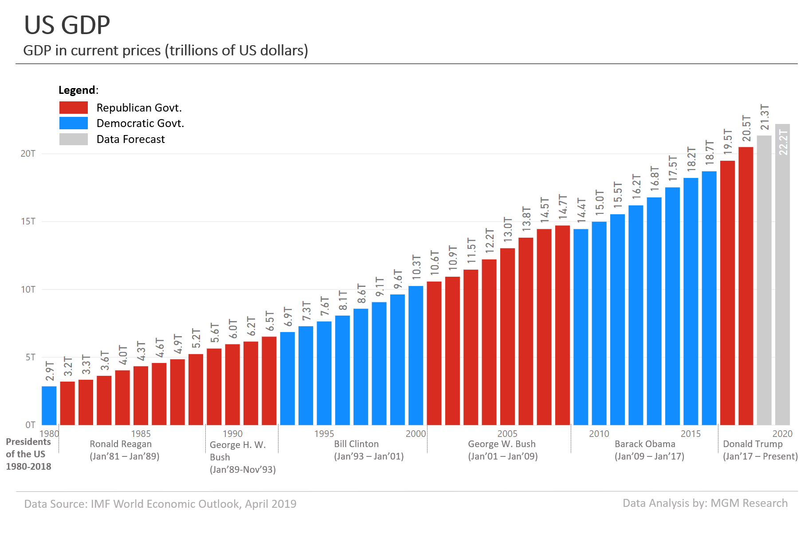
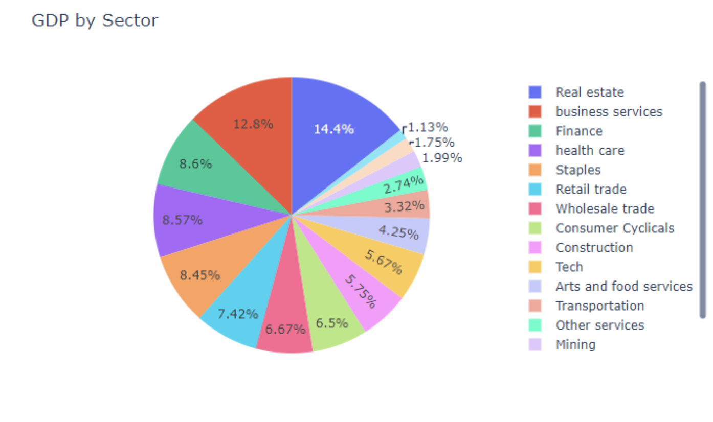
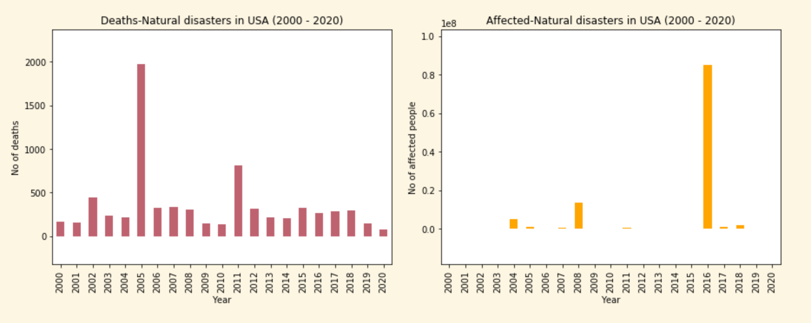
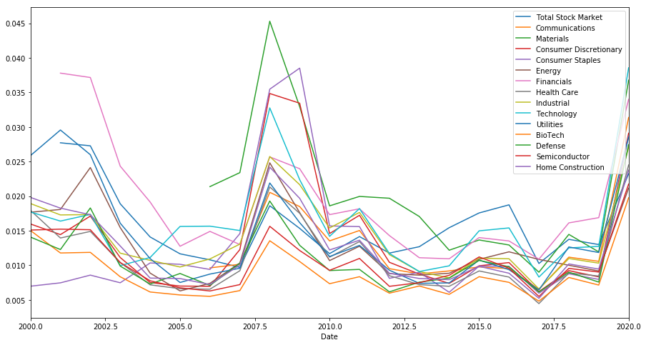
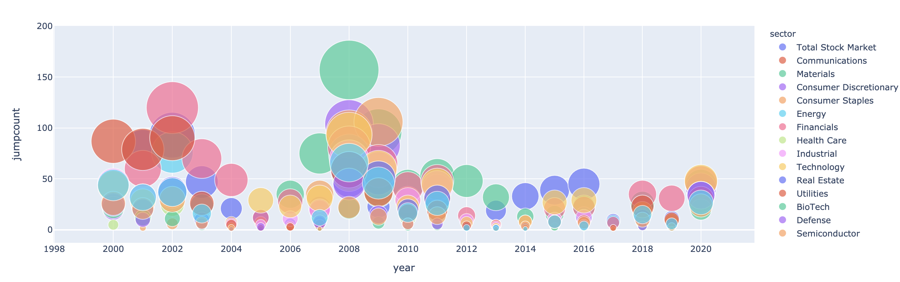
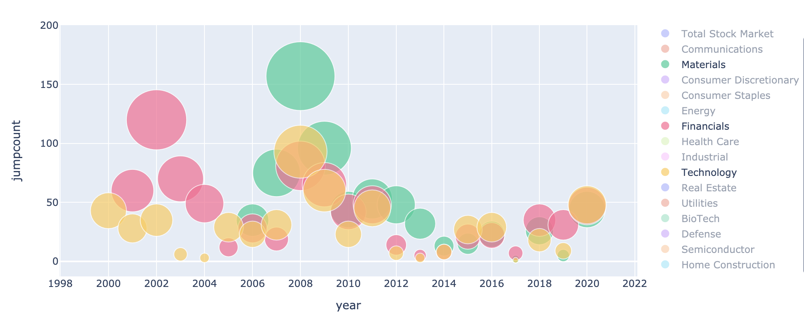
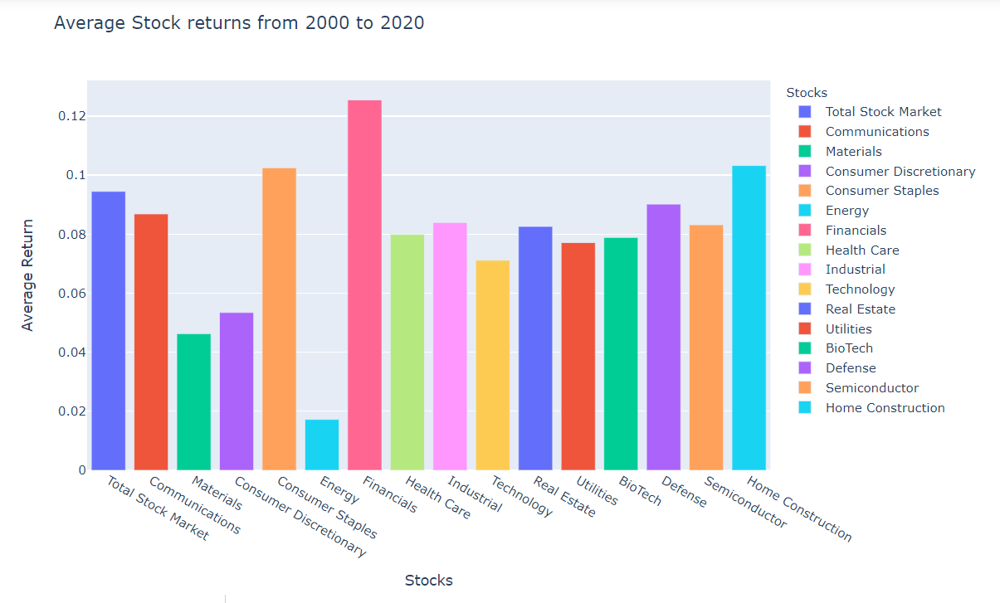
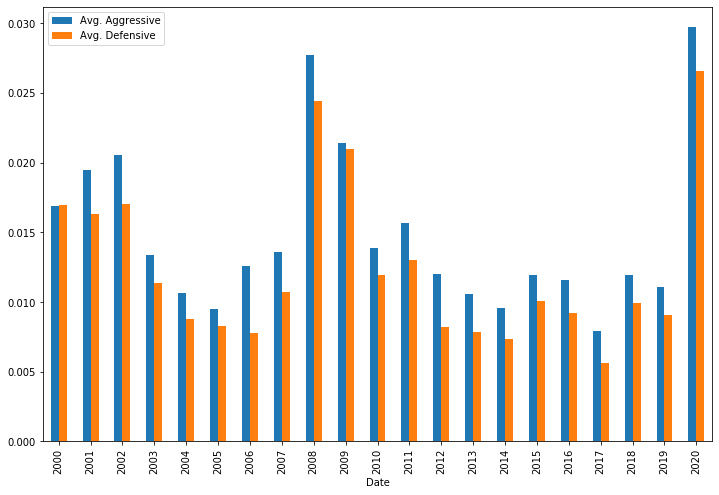
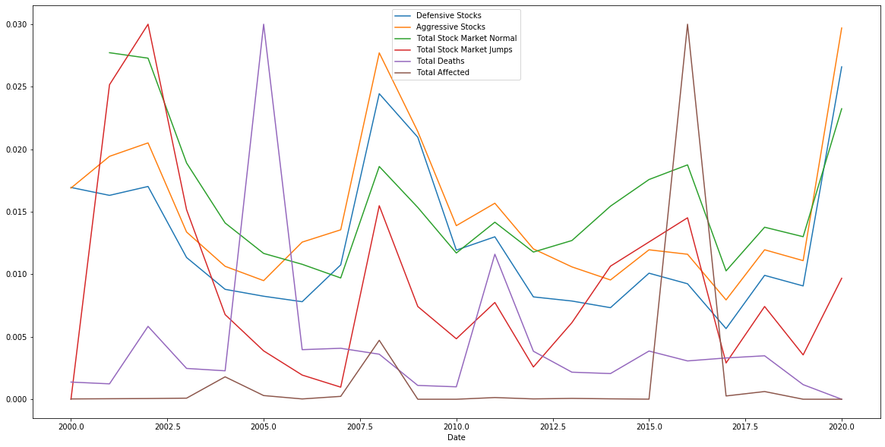
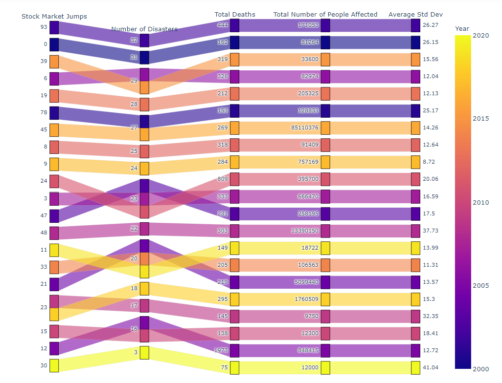

# FinTech BootCamp Project_1

## *Scott, Jatinder, Jason*
---

### We are looking at the trends in the US economy and the impact when a natural disasters occur. Comparing the effect on individual sector jumps at 2.5% to normal standard deviation since 2000.

***" When is the right time to buy? "***

## **Sectors and Disasters**

### In this section we were trying to understand what sectors of the market were hit during those major events, and then find out if there were any patterns to which sectors had the fastest recovery.

 
- IN THIS GRAPH WE COMPARED THE JUMPS AGAINST EACH OF THE SECTORS TO SEE IF ANY INDUSTRY HAS CONSISTENTLY HIGHER VOLITILATY THEN THE REST (*worldbank.com*). 

BUBBLE GRAPH THAT SHOWS EACH SECTOR AND THE NUMBER OF TIMES IT JUMPS OVER 2.5%

(*stockmarketjumps.com*)

This graph shows the average returns per sector over the course of the last 20 years to determine which sectors are growing and performing better than others. 

## DEFENSIVE VS AGGRESSIVE SECTORS
### What do you notice about the graph? 

- **Aggressive Sectors = Communications, Materials, Financials, Technology, BioTech, Semiconductor, Materials**
- **Defensive Sectors = Consumer Staples, Home Construction, Defense, Healthcare, Utilities**

- Defensive stocks had higher average returns only one time in 20 years, Aggressive stocks had higher returns in 19/20 years.

## **What sectors do you think had the best recorvery???**

### - The graph below shows the Defensive and Aggressive sectors compared to the total stock market as well as the number of people who were considered affected by the disaster along with a line for total deaths.  

- We discovered that there is no real correlation to any of these sectors and the number of people affected.  

# Conclusion 
## Based on our groups preliminary exploratory analysis as an overall conclusion we found that despite what common knowledge might say. When the market crashes or dips, investing in industries considered "aggressive" would probably reward higher returns. We also noticed that the market is typically quick to recover from a disaster event. Meaning the faster you get in after a crash the better. 